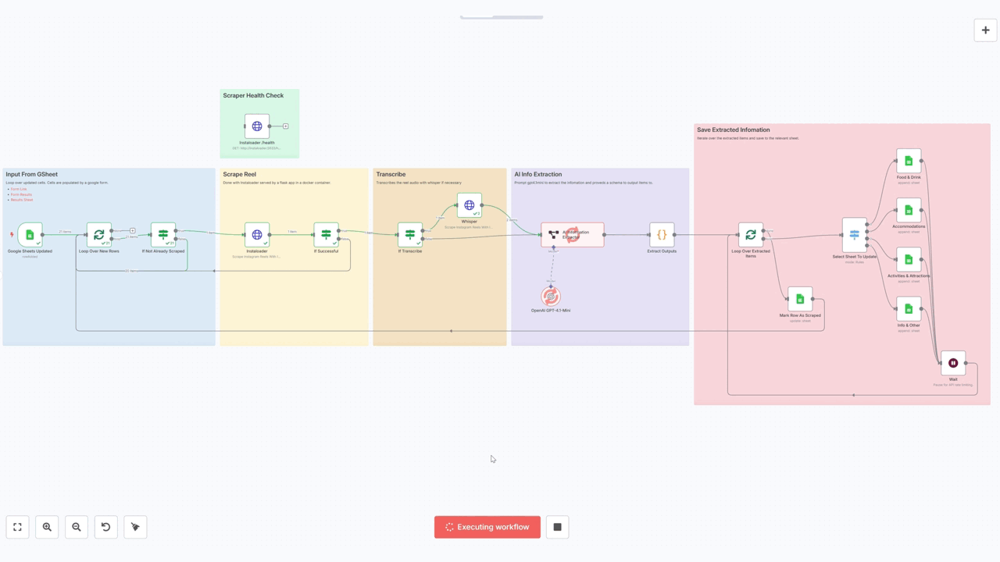

# Agentic AI Instagram Scraper

Self hosted AI workflow for scraping instagram reels audio and description, summaries, categories, and stored for quick viewing.

While planning an upcoming trip to bali I foundmyself watching lots of reels with all sorts of advice from where to eat and stay, to travel and safety tips. However I myself saving them never to look at them again. So I decided to see if I could try build an agentic AI pipeline to organise this information. This is how I build a self-hosted AI agent to scrape instagram reels and research my trip!

## Capabilities:

- Submit Reels to scrape as a link in a Google form.
- Scrape the description and transcribe the audio.
- Extract and categorise the information with a AI LLM
- Save the research in the relevant categories google sheet

## Technologies:

The workflow was built with a tool called n8n, a low code/no code agentic workflow building tool. I combined this with a python library called Instaloader to scrape the reel video and description while the video was transcription was done with OpenAI’s Whisper python library.

- n8n. A workflow...
- Python libraries:
- - OpenAI Whisper
- - Instadloader for scraping instagram, Whisper.
- Docker & Docker Compose for orchestrating these services on my home server.
- GPT-4.1-mini and OLlama Mmodels for sumarisation and catogirisation.

## Walk through

There are 4 steps to the program ... 

### Step 1

### Step 2 Scrape Reel

Decided to run these as ser

### Step 3 Transcribe Audio

### Step 4 AI Summarisation  

## Results

Overall im quite impressed with the results. This is the results from about 20 scrape reels totalling about 2p in cost. I am impressed with the amount of infomation extracted. The info is only as good as the video it comes from but the AI was generaly very good at seporating and summarising the info. It struggled a bit sometimes with catagorising, I especaly had issue with food and drink hygeen tips being put in Food & Drink but I didnt spend long on prompt engineering and im sure I could have achived better results here with some expermentation.

I tried a veriaty of models selfhosted and through api tokens. I found ChatGPT-4.1-nano struggled with catagorisation so switch to the mini model for a compramise of cost and accuracy. I tried Self hosted models such as TinyLLama which ran well ok my server's cpu but wasnt very accurate. Llama 3.1 with about 4B tokens worked ok on my PC's gpu but was too slow on my servers cup. Overall I found this model to also struggle with classification a little as well as sticking to the json schema.

## Challenges

### AI Limitations: 
Occasionally, even GPT-4.1-mini struggled with accurate categorization, especially with foreign names and locations. It sometimes mistook adverts as relevant content.

### Self-Hosting
Though n8n offers a cloud-hosted option, I opted for self-hosting primarily for three reasons:
- Cost Efficiency: I wanted to avoid ongoing subscription costs even though it seems n8n has a generous free tier.
- Learning: Hosting it myself offered opportunities to deepen my understanding of networking, server management
- Privacy: data privacy, not so much necessary for this, but maybe for future other projects.

Initial setup of n8n was straightforward using Docker Compose, although configuring the network infrastructure to securely expose the services to the internet (necessary for connecting with Google Sheets APIs) was a bit fiddly. Ironicaly, it became as much a DevOps and networking project as it was an AI endeavour. Overall though I would defo recommend it as it was a lot of fun to self-host and a good learning exercise.

### Research Is Only As Good As Your Data
When i paid colser attention picking reels to scraper it did hilight how many were mostly just advatising or the same advice repeated. Finding good reels to scrape became more difficult than getting the infomation from them.

## Thoughts On N8N

### Pros:
- Visual interface for quickly seeing and undersanding your workflows.
- Visual debugging tools made development and testing very easy.
- Lots of prebuilt tools and integrations.
Cons:
- Node interfaces could be complicated and fiddly.
- Large workflows quickly become cumbersome.

The primary goal of this project was to experiment with n8n and have a go with this seeminly fun visual tool to harnis the wonders of AI. While I enjoyed I enjoyed it I dont think this low code/no code tool is quite aimed at at me and I am looking into other code solutions such as Langcain and Langgraph for future projects.
